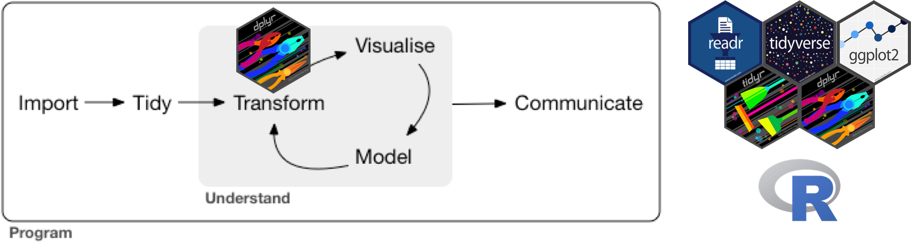
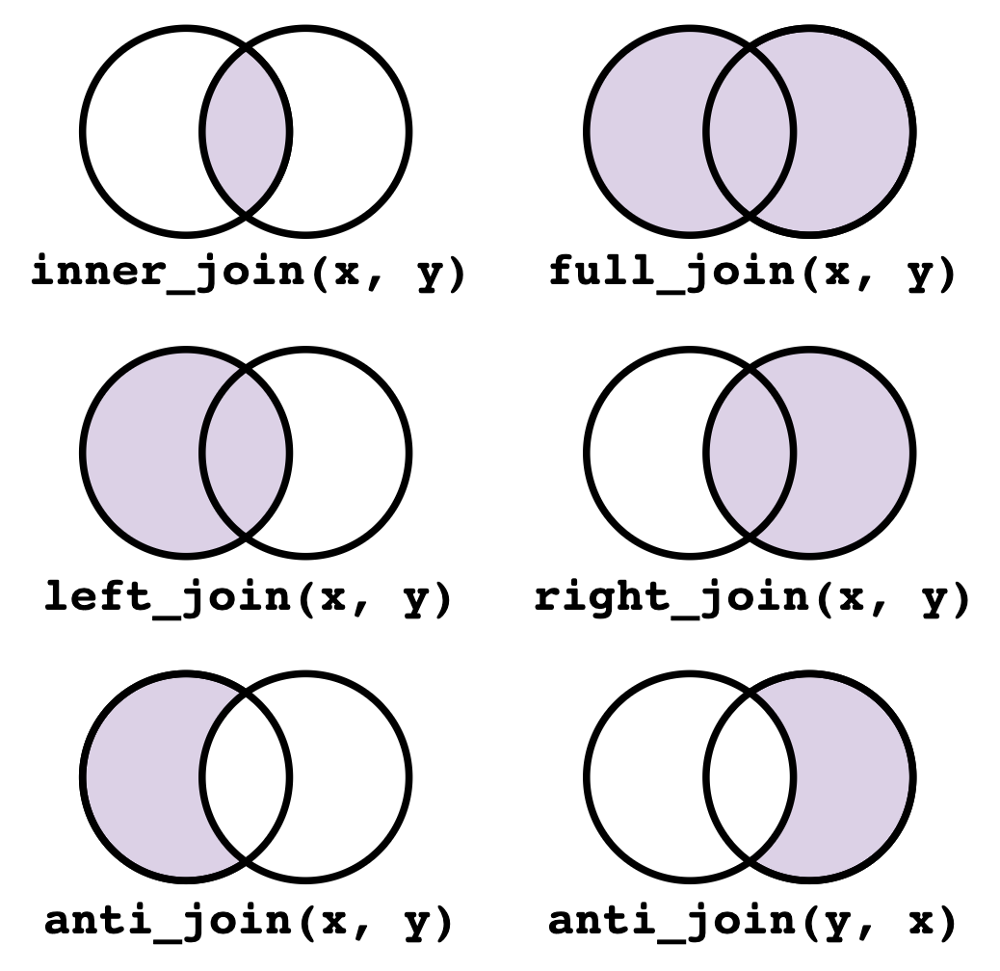

```{r setup, include=FALSE}
ggplot2::theme_set(ggplot2::theme_bw()) # set ggplot theme
```

```{r, fig.align='center', out.width="75%", echo = FALSE}
options(warn=-1)
# knitr::include_graphics("unit-1-lecture-3-figures/unit-1-lecture-3.png")
```

# Introduction

Today we'll continue with exploratory data analysis, focusing on **data transformation** using the `dplyr` package.

```{r, fig.align='center', out.width="100%",fig.cap = "Data transformation (adapted from R4DS Chapter 1).", echo = FALSE}

```

Let's load the `tidyverse` packages. 
```{r, message = FALSE}
library(tidyverse)
```

Recall the `diamonds` dataset.
```{r}
diamonds
```

In addition to plotting these data, we might want to explore them by transforming them in various ways:

- Choose a subset of observations (rows) based on various criteria (`filter()`).
- Choose a subset of variables (columns) by their names or other criteria (`select()`).
- Reorder the rows (`arrange()`).
- Create new variables as functions of existing variables (`mutate()`).
- Collapse many values down to a single summary (`summarize()`).

These five core functions provide the verbs for a language of data manipulation. They functions can be strung together in sequences using the pipe operator (`|>`). The `dplyr` verbs can be used with the `.by` argument, which changes the scope of each function from operating on the entire dataset to operating on it group-by-group. 

We will also cover two more useful elements in data processing:

- Filling in missing data (`fill()`).
- Combining multiple datasets based on common entries (`join()`).

# Isolating data

## `filter()`

A **`filter`** operation subsets the observations (rows) of the data based on a certain logical condition:
```{r}
# subset to diamonds with price at least $10,000
filter(diamonds, price >= 10000)
```

Commonly used **comparison operators** are `==` (equal), `!=` (not equal), `<=` (less than or equal), `<` (less than), `>=` (greater than or equal), `>` (greater than), `%in%` (in). Note that `%in%` is usually employed to check whether a categorical variable belongs to a set of values, e.g. `cut %in% c("Very Good", "Ideal")`. 

Logical conditions can be combined using **boolean** operators, including `&` (and), `|` (or), and `!` (not). For example:
```{r}
# subset to diamonds with price at least $10,000 AND clarity VVS1 or IF
filter(diamonds, price >= 10000 & clarity %in% c("VVS1", "IF"))
```

Exercise: Filter `diamonds` to those with ideal cut and at least 3 carats. How many such diamonds are there?

## `select()`

A **`select`** operation subsets the columns of the data, for example based on their names:
```{r}
# select columns corresponding to the "4 C's"
select(diamonds, carat, cut, color, clarity)
```

The `select()` function comes with helper functions, such as the following:

- `-` selects all columns except the given ones, e.g. `select(diamonds, -carat)`
- `:` selects columns between the given ones, e.g. `select(diamonds, carat:clarity)`
- `contains` selects columns containing a given string, e.g. `select(diamonds, contains("c"))`
- `starts_with` selects columns starting with a given string, e.g. `select(diamonds, starts_with("c"))`
- `ends_with` selects columns ending with a given string, e.g. `select(diamonds, ends_with("t"))`
- `where` selects columns based on their type, e.g. `where(is.numeric)` selects all numeric columns

Exercise: Select all columns except `x`, `y`, `z`.

## `arrange()`

An **`arrange`** operation sorts the rows of the data frame according to one of its variables:
```{r}
arrange(diamonds, carat)       # sort diamonds by carat (ascending)
arrange(diamonds, desc(carat)) # sort diamonds by carat (descending)
```

Exercise: Arrange diamonds in decreasing order of their length. How long is the longest diamond?

# Deriving information

## `mutate()`

A **`mutate`** operation adds another column as a function of existing columns:
```{r}
# add column that is the price per carat of each diamond
mutate(diamonds, price_per_carat = price / carat)
```

Some useful functions to use with mutate are arithmetic operators (`+`, `-`, `*`, `/`, `^`) or logical comparisons (`<`, `<=`, `>`, `>=`, `!=`). For example,
```{r}
# add column that indicates whether a diamond's price per carat is at least $10k
mutate(diamonds, fancy_diamond = price / carat > 10000)
```

Note that `fancy_diamond` is a logical variable.

Complex combinations of existing variable can be obtained with `mutate()` via `if_else()` and `case_when()`. For example:
```{r}
# use if_else() if you have two cases
mutate(diamonds,
  good_value =
    if_else(
      condition = carat > 2, # check whether carat > 2
      true = price < 5000,   # if so, good value if cheaper than $5k
      false = price < 1000   # if not, good value if cheaper than $1k
    )
) 
```

```{r}
# use case_when() if you have more than two cases
mutate(diamonds,
  value =
    case_when(
      carat > 2 & price < 5000 ~ "good", # if carat > 2 and price < 5000, then good
      carat > 1 & price < 2500 ~ "ok",   # if carat > 1 and price < 2500, then ok
      TRUE                     ~ "bad"   # otherwise, bad
    )
)
```

Exercise: Add a variable called `good_color` that is `TRUE` if the color is `D`, `E`, `F`, `G` and `FALSE` otherwise.

## `summarize()`

A **`summarize`** operation calculates summary statistics combining all rows of the data:
```{r}
# find the number of "fancy" diamonds (price per carat at least $10000), 
summarize(diamonds, num_fancy_diamonds = sum(price / carat > 10000))
```
Useful summary functions are `sum()`, `mean()`, `median()`, `min()` `max()` `var()`, `sd()` for numeric variables and `any()`, `all()`, `sum()`, `mean()` for logical variables. The function `n()` takes no arguments and calculates the number of observations (rows) in the data.

More than one summary can be extracted in a single call to `summarize()`:
```{r}
# find the number of "fancy" diamonds (price per carat at least $10000), 
#  as well as the mean price of a diamond
summarize(diamonds, 
          num_fancy_diamonds = sum(price / carat > 10000), 
          mean_diamond_price = mean(price))
```

Exercise: Use `summarize` to determine if there are any diamonds of at least one carat that cost less that $1000.

# More complex transformations

## The pipe (`|>`)

When stringing together multiple `dplyr` verbs, the pipe `|>` is extremely useful. The pipe passes the quantity on its left-hand side to the first argument of the function on the right hand side: `x |> f(y)` is translated to `f(x,y)`. The first argument of all `dplyr` verbs is the data, so the pipe allows us to apply several operations to the data in sequence. For example:
```{r}
diamonds |>                                    # pipe in the data
  filter(cut == "Premium") |>                  # restrict to premium cut diamonds
  mutate(price_per_carat = price / carat) |>   # add price_per_carat variable
  arrange(desc(price_per_carat))               # sort based on price_per_carat
```

The pipe can be used to pass data between different `tidyverse` packages, e.g. from `dplyr` to `ggplot2`:
```{r, fig.width = 4, fig.height = 3}
diamonds |>                                        # pipe in the data
  filter(cut == "Premium") |>                      # restrict to premium cut 
  mutate(price_per_carat = price / carat) |>       # add price_per_carat variable
  ggplot() +                                       # start a ggplot
  geom_histogram(aes(x = price_per_carat))         # add a histogram
```

Exercise: Compute the mean price for diamonds of volume at least one carat.

NOTE: The original pipe operator was written `%>%` and was built into the `magrittr` R package. Since R version 4.1, there is a pipe operator `|>` built into base R. In this class, we will use the *base pipe* `|>`. Read more about the pipe [here](https://r4ds.hadley.nz/data-transform.html#sec-the-pipe). 

## Grouped transformations

Sometimes we'd like to apply transformations to groups of observations based on categorical variables in our data. For example, suppose we'd like to know the maximum diamond price for each value of `cut`. We can do this using the `.by` argument to `summarize()`:
```{r}
diamonds |>                                      # pipe in the data
  summarize(max_price = max(price), .by = cut)   # find the max price per cut
```

We can group by multiple characteristics, e.g.:
```{r}
diamonds |>                             # pipe in the data
  summarize(max_price = max(price),     # find the max price
            .by = c(cut, clarity))      # for each combination of cut & clarity 
```

While `summarize()` is the most common verb paired with `.by`, `filter()` and `mutate()` verbs can be paired with `.by` as well, which is useful when grouped summaries are involved. Consider the following example, with `filter()`:
```{r}
diamonds |>                         
  filter(price > mean(price), .by = cut)
```

Exercise: What does the above code do? 

A common type of grouped summary is to tabulate the number of values of a categorical variable. A shortcut for this is the `count()` function, e.g.:
```{r}
count(diamonds, cut)
```

Exercise: Reproduce the output of `count(diamonds, cut)` via `summarize()`. 

NOTE: Until recently, the preferred way to carry out grouped operations was via `group_by()`. For example:
```{r}
diamonds |>                           # pipe in the data
  group_by(cut) |>                    # group by cut
  summarize(max_price = max(price))   # find the max price per cut
```
Since `dplyr` version 1.1.0, the `.by` argument to `dplyr` verbs provides a more convenient way to carry out group operations. For more, see [here](https://www.tidyverse.org/blog/2023/02/dplyr-1-1-0-per-operation-grouping/). 

## Storing the transformed data

Note that applying various functions to `diamonds` does not actually change the data itself. We can check that, after all those operations, `diamonds` is still the same as it was in the beginning:
```{r}
diamonds
```

If we want to save the transformed data, we have the use the assignment operator, `<-`:
```{r}
max_prices <- diamonds |>                       # pipe in the data
  summarize(max_price = max(price), .by = cut)  # find the max price per cut
max_prices
```

# Applying the same operation across multiple variables (`across()`)

In this section, we will learn how to either `summarize()`, `mutate()`, or `filter()` based on several columns at the same time.

## `summarize()` based on many columns

Suppose we want to find the median value for each numeric variable in `diamonds`. Here is one way we could do this with `summarize()`:

```{r}
diamonds |>
  summarize(
    carat = median(carat),
    depth = median(depth),
    table = median(table),
    price = median(price),
    x = median(x),
    y = median(y),
    z = median(z)
  )
```
However, it is best to avoid copying and pasting code. The `across()` function allows us to summarize several variable in the same way:
```{r}
diamonds |>
  summarize(across(
    .cols = c(carat, depth, table, price, x, y, z),
    .fns = median
  ))
```
To clean this code up even further, we can use the fact that the `.cols` argument is compatible with the `select()` helper functions we discussed before. In this case, to select all numeric columns we can use `where()`:
```{r}
diamonds |>
  summarize(across(.cols = where(is.numeric), .fns = median))
```

## `mutate()` based on many columns

Now, suppose we want to mutate, rather than summarize, several columns. Suppose we want to compute the square of each numeric column. For this, we can use `across()` again, except we have to define our own function to pass to `.fns`, which takes as input a numeric value `x` and outputs its square:

```{r}
diamonds |>
  mutate(across(.cols = where(is.numeric), .fns = function(x) (x * x)))
```

If we want to keep the original variables while computing their absolute values, we also need to specify the `.names` argument of `across()`, which specifies how to name each newly created column:
```{r}
diamonds |>
  mutate(
    across(
      .cols = where(is.numeric), 
      .fns = function(x)(x * x),
      .names = "{.col}_square"
    )
  )
```

## `filter()` based on many columns

Finally, Suppose we wish to find the `diamonds` that measure at least 6mm in each dimension. We could do this via the `&` operator:
```{r}
diamonds |>
  filter(x > 6 & y > 6 & z > 6)
```

We can make this code a bit cleaner using the `if_all()` function:
```{r}
diamonds |>
  filter(if_all(.cols = x:z, .fns = function(w)(w > 6)))
```

If we wanted to find diamonds that are at least 6mm in *any* dimension, we could use `if_any()`:
```{r}
diamonds |>
    filter(if_any(.cols = x:z, .fns = function(w)(w > 6)))
```
We can combine `if_all()` or `if_any()` with other logical functions.  

Exercise: Find all diamonds that are at least 6mm in each direction *and* at least 4 carats.
 

# Joining {#sec:joining}

It’s rare that a data analysis involves only a single table of data. Typically you have many tables of data, and you must combine them to answer the questions that you’re interested in. Collectively, multiple tables of data are called relational data because it is the relations, not just the individual datasets, that are important. 

The most common way to combine two tables is to join them together. A join is a special type of merge that combines two tables based on a common variable. The `dplyr` package provides several functions for joining tables, including `left_join()`, `right_join()`, `inner_join()`, and `full_join()`. They offer different ways to combine the data, depending on how you want to handle rows that do not have a match in the other table.

```{r, fig.align='center', out.width="50%",fig.cap = "Various joining schemes, where purple colored area represents the rows preserved in the joined data.", echo = FALSE}

```

Let's use a simple example to see how joining works. 

```{r}
band_members <- data.frame(
  Name = c("Seth", "Francis", "John"),
  Band = c("Com Truise", "Pixies", "The New Year")
)
 
band_instruments <-data.frame(
  Name = c("Francis", "Bubba", "Seth", "Michael"),
  Instrument = c("Guitar", "Guitar", "Synthesizer", 'Bass')
)

# View the dataframes
band_members
band_instruments
```

We have a dataframe `band_members` that contains the names of band members and their respective bands, and a dataframe `band_instruments` that contains the names of band members and their instruments. In the analysis, we want to combine these two dataframes to see which band member plays which instrument. The choice of the join function decides how you handle rows that do not have a match in the other table.

## Left join

`left_join()` preserves all rows in the first dataframe with a matched row in the `by` column(s) in the second dataframe. Missing values in other columns are filled with `NA`.

```{r}
left_join(band_members, band_instruments, by = 'Name')
```

## Right join 

`right_join()` preserves rows in the second dataframe, in a similar way as above. 

```{r}
right_join(band_members, band_instruments, by = 'Name')
```

## Inner join

`inner_join()` preserves only the rows that have a match in both dataframes.

```{r}
inner_join(band_members, band_instruments, by = 'Name')
```

## Full join 

`full_join()` preserves all rows in both dataframes, filling in `NA` for missing values.

```{r}
full_join(band_members, band_instruments, by = 'Name')
```

# Missing values

Missing values, marked with `NA`, are often present in real datasets. Consider the following simple dataset:
```{r}
stocks <- tibble(
  year   = c(2015, NA, NA, 2015, 2016, 2016, 2016),
  qtr    = c(   1,    2,    3,    4,   NA,    3,    4),
  return = c(1.88, 0.59, 0.35,   NA, 0.92, 0.17, 2.66)
)
stocks
```
The `NA` means that the return for the fourth quarter of 2015 is missing. Changing the representation of a dataset can create more missing values.  
There are multiple ways to handle missing data:

-   Deleting Rows: This is a straightforward method but can result in a loss of valuable data, especially if a large portion of the dataset has missing values.

-   Mean Imputation: This is a simple and quick method: imputing a
    missing value by using the mean of the available values in that column. But it may lead to biased estimates, especially if the missing data is not random.
    
 -   More advanced methods: These include regression imputation, multiple imputation, and machine learning techniques. These methods can provide more accurate estimates but are more complex to implement. We will not cover these methods at this point. 

Usually it's a good idea to treat missing values with care, e.g. by thinking about why those values might be missing in the first place. 
 
## Deleting Rows with Missing Data

The simplest approach to dealing with missing values in a dataset is to remove all rows containing any missing values. This can be done via `drop_na()` in the tidyverse package. For example:
```{r}
stocks |>
  drop_na()
```

Omitting all rows with missing values can lead to a significant loss of data, especially if many rows have at least one missing value. Sometimes, we may choose only to remove rows with NA values in specific columns. 

```{r}
stocks |> 
  drop_na(qtr, return)
```


## Imputation - Mean  

Another common approach to handling missing data is to impute with the mean of all other non-NA values in the same column. This is suitable for numerical values, but one needs to be careful about the missingness pattern. 

```{r}
# Mean Imputation
# Step 1: Identify missing values in return
is_missing_return <- is.na(stocks$return)

# Step 2: Calculate the mean of return, ignoring NA values
return_mean <- mean(stocks$return, na.rm = TRUE)

# Step 3: Create a new column and impute missing values with the mean
stocks$return_MeanImpute <- stocks$return
stocks$return_MeanImpute[is_missing_return] <- return_mean

stocks
```
 

# References:

- [`dplyr` cheat sheet](https://github.com/rstudio/cheatsheets/blob/master/data-transformation.pdf)
- [Work with Data tutorials](https://rstudio.cloud/learn/primers/2)
- [R4DS](https://r4ds.hadley.nz/) Chapters 3, 5, 18, 19

# Exercises

Use `dplyr` to answer the following questions:

- What is the minimum diamond price in this dataset? See if you can find the answer in two different ways (i.e. using two different `dplyr` verbs).
- How many diamonds have length at least one and a half times their width?
- Among diamonds with colors D, E, F, G, what is the median number of carats for diamonds of each cut?
