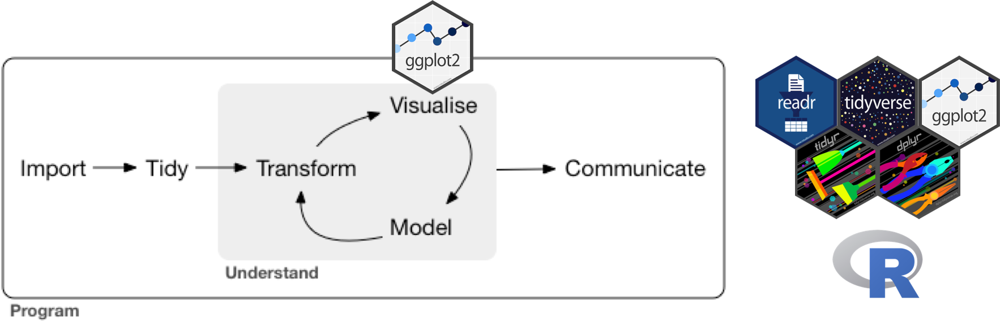

```{r setup, include=FALSE}
ggplot2::theme_set(ggplot2::theme_bw()) # set ggplot theme
```

```{r, fig.align='center', out.width="75%", echo = FALSE, include=FALSE}
options(warn=-1)
# knitr::include_graphics("unit-1-lecture-2-figures/unit-1-lecture-2.png")
```

# Case Study: Diamonds

In this lecture, we will explore the `diamonds` dataset built into `ggplot2`. 

```{r, message = FALSE}
library(tidyverse)
diamonds
```

Let's recall some terminology from Lecture 1:

- **Variables:** What do variables in this dataset represent? How many of them are there?
- **Observations:** What do observations in this dataset represent? How many of them are there?
- **Values:** What are examples of values in this dataset?
- **Continuous:** Which variables are continuous?
- **Categorical:** Which variables are categorical?

We can learn more about the variables in this dataset by looking at the documentation:
```{r}
?diamonds
```

# Exploratory Data Analysis

Before we start modeling our data, it's a good idea to first explore it. The goals of **exploratory data analysis** (EDA) are:

- Gaining a basic familiarity with the data
- Exploring the **variation** of individual variables (the tendency of the values of a variable to change from observation to observation)
- Exploring the **covariation** between pairs of variables (the tendency for the values of two or more variables to vary together in a related way)
- Identifying and, if possible, fixing flaws in the data
- Searching for patterns and generating hypotheses

We can explore data by visualizing it or transforming it. 
```{r, fig.align='center', out.width="100%",fig.cap = "Data visualization (adapted from R4DS Chapter 1).", echo = FALSE}

```

The subject of this lecture is the former: **data visualization** using `ggplot2`. The figure below summarizes common strategies for visualizing variation and covariation. We'll go through each one in this lecture.
```{r, fig.align='center', out.width="75%",fig.cap = "Common strategies for visualizing variation and covariation (source: R4DS Chapter 7).", echo = FALSE}
knitr::include_graphics("unit-1-lecture-2-figures/plots-table.png")
```

# Variation

## Discrete variables

We usually use **bar charts** to visualize variation in discrete variables. These can be created through `geom_bar()`, which requires the aesthetic `x` (the variable whose variation we'd like to plot). Let's take a look at the variation in `cut`:

```{r, fig.width = 4, fig.height = 3}
ggplot(data = diamonds) + 
  geom_bar(mapping = aes(x = cut))
```

What is the most common kind of diamond cut? 

## Continuous variables

We usually use **histograms** to visualize variation in continuous variables. These can be created through `geom_histogram()`, which requires the aesthetic `x` (the variable whose variation we'd like to plot). Let's take a look at the variation in `carat`:
```{r, fig.width = 4, fig.height = 3}
ggplot(data = diamonds) +
  geom_histogram(mapping = aes(x = carat))
```

What can be said about the variation in `carat`? Most of the values of `carat` are below 3, so let's zoom in to that portion of the plot using `coord_cartesian`:
```{r, fig.width = 4, fig.height = 3}
ggplot(data = diamonds) +
  geom_histogram(mapping = aes(x = carat)) + 
  coord_cartesian(xlim = c(0,3))
```

Note the warning message about the number of bins. We might need to experiment to find a meaningful value for the number of bins in a histogram. Let's try decreasing the bin width:
```{r, fig.width = 4, fig.height = 3}
ggplot(data = diamonds) +
  geom_histogram(mapping = aes(x = carat), binwidth = 0.01) +
  coord_cartesian(xlim = c(0,3))
```

That's a peculiar pattern! What kinds of `carat` values do most diamonds have? Why?

# Covariation

## Discrete versus discrete

We usually use **count plots** to visualize covariation between two discrete variables. These represent the number of observations for which the two variables take each combination of values via the size of points. Count plots can be generated using `geom_count()`, and require `x` and `y` aesthetics. For example, let's assess the covariation between `cut` and `clarity`:
```{r, fig.width = 5, fig.height = 4}
ggplot(data = diamonds) +
  geom_count(mapping = aes(x = cut, y = clarity))
```

What can we say about the relationship between `cut` and `clarity`?

## Continuous versus continuous

### Many to one

We usually use **scatter plots** to visualize covariation between two continuous variables. These are useful when we can have many y values for each x value. Scatter plots can be generated using `geom_point()`, and require `x` and `y` aesthetics. For example, let's assess the covariation between `x` and `y`:
```{r, fig.width = 3.5, fig.height = 3.5}
ggplot(data = diamonds) +
  geom_point(mapping = aes(x = x, y = y))
```

Whoa! There seem to be some weird outliers in the data. We should probably look into those more and perhaps remove them. For now, let's just zoom in on the part of the plot where most of the points lie:
```{r, fig.width = 3.5, fig.height = 3.5}
ggplot(data = diamonds) +
  geom_point(mapping = aes(x = x, y = y)) +
  coord_cartesian(xlim = c(3.5, 10), ylim = c(3.5,10))
```

Hm! It looks like most of the points lie near the line `y = x`. To confirm this, we can add that line to the plot via `geom_abline()`:
```{r, fig.width = 3.5, fig.height = 3.5}
ggplot(data = diamonds) +
  geom_point(mapping = aes(x = x, y = y)) +
  geom_abline(slope = 1, intercept = 0, color = "red") +
  coord_cartesian(xlim = c(3.5, 10), ylim = c(3.5,10))
```

Why might we have `x` and `y` approximately equal for most diamonds in this dataset? Why aren't `slope = 1`,  `intercept = 0`, and `color = "red` inside of an `aes()`?

Note that horizontal and vertical lines may be added to plots using `geom_hline()` and `geom_vline()`, respectively. Check out the details via `?geom_hline`.

### One to one

In some cases, we have only one value of y for each value of x. For example, consider the average diamond price for each value of carat. Let's first construct the requisite data frame (you need not understand the following code at this point):
```{r}
avg_price_by_carat <- diamonds |>
  mutate(carat = round(carat, 1)) |>
  group_by(carat) |>
  summarise(avg_price = mean(price))
avg_price_by_carat
```

To plot `avg_price` versus `carat`, we would use a **line plot**. We can create a line plot via `geom_line()`, which requires both `x` and `y` aesthetics:
```{r, fig.width = 4, fig.height = 3}
ggplot(data = avg_price_by_carat) +
  geom_line(mapping = aes(x = carat, y = avg_price))
```

What is the relationship between average price and carat? Does this make sense?

## Continuous versus discrete

We usually use **box plots** to visualize covariation between a continuous variable and a discrete variable. A single box plot is a way to visualize the variation in a continuous variable, while side by side box plots allow us to visualize how the distribution of a continuous variable changes based on the values of a discrete variable. We can construct side by side box plots via `geom_boxplot()`, which requires `x` and `y` aesthetics. For example, let's see how the price of a diamond depends on its cut:
```{r, fig.width = 4, fig.height = 3}
ggplot(data = diamonds) + 
  geom_boxplot(mapping = aes(x = cut, y = price))
```

Those thick black lines in the middle denote the median price for each cut. What trend do we observe in the median price based as the cut improves? Is this what you would have expected?
 
# Additional visualization tools

## Axis transformations

Some variable are better visualized on a transformed scale, e.g. on a logarithmic scale. A tell-tale sign of a variable that would benefit from a logarithmic transformation is a very long tail, as we saw with `carat`:
```{r, fig.width = 4, fig.height = 3}
ggplot(data = diamonds) +
  geom_histogram(aes(x = carat), binwidth = 0.01)
```

We can put the x-axis on a logarithmic scale using `scale_x_log10()`:
```{r, fig.width = 4, fig.height = 3}
ggplot(data = diamonds) +
  geom_histogram(aes(x = carat), binwidth = 0.01) +
  scale_x_log10()
```

The same goes for variables plotted on the y axis. For example:
```{r, fig.width = 4, fig.height = 3}
ggplot(data = diamonds) +
  geom_point(aes(x = carat, y = price)) +
  scale_x_log10() + 
  scale_y_log10()
```

## Multiple geoms in the same plot

We can add as many geoms as we want to the same plot. We've already seen `geom_point()` and `geom_abline()` in the same plot. Let's see another example by adding the individual points to the plot of `avg_price` versus `carat`:
```{r, fig.width = 4, fig.height = 3}
ggplot(data = avg_price_by_carat) +
  geom_line(mapping = aes(x = carat, y = avg_price)) +
  geom_point(mapping = aes(x = carat, y = avg_price))
```

Note that `geom_line()` and `geom_point()` have the same exact aesthetic mapping. Any aesthetic mapping that applies to all geoms in a plot can be placed inside of `ggplot` instead of inside the individual geoms. This makes that aesthetic mapping "global":
```{r, fig.width = 4, fig.height = 3}
ggplot(data = avg_price_by_carat, mapping = aes(x = carat, y = avg_price)) +
  geom_line() +
  geom_point()
```

## Multiple aesthetics in the same geom

Any geom can have multiple aesthetics. We've already seen this, e.g. specifying both `x` and `y` aesthetics for `geom_point()`. But we can add still more aesthetics, e.g. color, for a richer plot. For example, let's consider plotting `price` versus `carat`:
```{r, fig.width = 4, fig.height = 3}
ggplot(data = diamonds) +
  geom_point(mapping = aes(x = carat, y = price))
```

We can color points based on the cut of the diamond:
```{r, fig.width = 5, fig.height = 3}
ggplot(data = diamonds) +
  geom_point(mapping = aes(x = carat, y = price, color = cut))
```

## Faceting

Each plot so far has contained just one **panel**. Sometimes, we want to break a plot into multiple panels based on the values of one or two categorical variables in the data. For example, consider again the relationship between `price` and `carat`. Instead of coloring points based on `cut`, we can **facet** the plot based on `cut`. When using one faceting variable, we would usually use `facet_wrap()`:
```{r, fig.width = 5, fig.height = 3}
ggplot(data = diamonds) +
  geom_point(mapping = aes(x = carat, y = price)) + 
  facet_wrap(~cut)
```

If we want all the panels to be in one row, we can also use `facet_grid()`:
```{r, fig.width = 9, fig.height = 2}
ggplot(data = diamonds) +
  geom_point(mapping = aes(x = carat, y = price)) + 
  facet_grid(. ~ cut)
```

Usually though, `facet_grid()` is used to facet on two categorical variables, creating a whole matrix of panels. For example:
```{r, fig.width = 7, fig.height = 7}
ggplot(data = diamonds) +
  geom_point(mapping = aes(x = carat, y = price)) + 
  facet_grid(clarity ~ cut)
```

## Plot customization

Virtually every aspect of a plot can be customized (plot title, axis titles, legend placement, font sizes, aspect ratio, etc). Work through the [Customize Plots](https://rstudio.cloud/learn/primers/3.8) tutorial and/or [R4DS Chapter 12](https://r4ds.hadley.nz/communication) to learn more. The most important reason to customize your plots is to make them easier to read and interpret. In addition to correctness, your homework and exams will be graded on **presentation quality**, including the quality of your plots. See Section 4 of [preparing-reports.pdf](https://katsevich-teaching.github.io/stat-4710-fall-2023/assets/preparing-reports.pdf) on Canvas for concrete guidelines.

# References:

- [`ggplot2` cheat sheet](https://github.com/rstudio/cheatsheets/blob/master/data-visualization.pdf)
- [Visualize Data tutorials](https://rstudio.cloud/learn/primers/3)
- [R4DS](https://r4ds.hadley.nz/) Chapters 2 and 10-12
- [preparing reports for STAT 4710](https://katsevich-teaching.github.io/stat-4710-fall-2023/assets/preparing-reports.pdf)

# Exercises

## Relating the carat and cut of a diamond

Recall this plot:

```{r, fig.width = 5, fig.height = 3, echo = FALSE}
ggplot(data = diamonds) +
  geom_point(mapping = aes(x = carat, y = price, color = cut))
```

What relationship does it suggest between carat and cut? Create a plot to directly visualize this relationship. What do you conclude? How does this explain the paradoxical trend we found in the plot below?
```{r, fig.width = 4, fig.height = 3, echo = FALSE}
ggplot(data = diamonds) + 
  geom_boxplot(mapping = aes(x = cut, y = price))
```

**Solution.**

## Relating the size and carat of a diamond

Create a plot to visualize the relationship between the carat and length of a diamond. Zoom in to exclude any outliers. What sort of relationship does your plot suggest? How would you explain this relationship?

**Solution.**

# Further practice (optional)

For further practice, work through the [Airbnb listings in Edinburgh](https://minecr.shinyapps.io/dsbox-01-edibnb/) activity.
